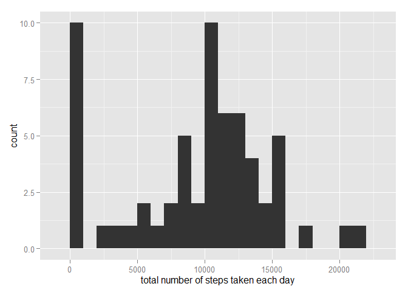

# Reproducible Research: Peer Assessment 1

## Loading and preprocessing the data

```r
activity <- read.csv("./data/activity.csv")
```

## What is mean total number of steps taken per day?

```r
library(ggplot2)
total.steps <- tapply(activity$steps, activity$date, FUN=sum, na.rm=TRUE)
mean(total.steps, na.rm=TRUE)
```

```
## [1] 9354.23
```

```r
median(total.steps, na.rm=TRUE)
```

```
## [1] 10395
```

```r
qplot(total.steps, binwidth=1000, xlab="total number of steps taken each day")
```

 

## What is the average daily activity pattern?

```r
library(ggplot2) 
averages <- aggregate(x=list(steps=activity$steps),
                      by=list(interval=activity$interval), 
                      FUN=mean, na.rm=TRUE) 
ggplot(data=averages, aes(x=interval, y=steps)) + 
   geom_line() + 
   xlab("5-minute interval") + 
   ylab("average number of steps taken")
```

 

The maximum number of steps?

```r
averages[which.max(averages$steps),]
```

```
##     interval    steps
## 104      835 206.1698
```

## Imputing missing values
Total number of missing value

```r
missing <- is.na(activity$steps)
table(missing)
```

```
## missing
## FALSE  TRUE 
## 15264  2304
```

All of the missing values are filled in with mean value for that 5-minute interval.
Replace each missing value with the mean value of its 5-minute interval

```r
fill.value <- function(steps, interval) {
    filled <- NA
    if (!is.na(steps))
        filled <- c(steps)
    else
        filled <- (averages[averages$interval==interval, "steps"])
    return(filled)
}
filled.activity <- activity
filled.activity$steps <- mapply(fill.value, filled.activity$steps, filled.activity$interval)
```
Now, using the filled data set, let's make a histogram of the total number of steps taken each day and calculate the mean and median total number of steps.

```r
total.steps <- tapply(filled.activity$steps, filled.activity$date, FUN=sum)
qplot(total.steps, binwidth=1000, xlab="total number of steps taken each day")
```

 

```r
mean(total.steps)
```

```
## [1] 10766.19
```

```r
median(total.steps)
```

```
## [1] 10766.19
```

## Are there differences in activity patterns between weekdays and weekends?
First, let's find the day of the week for each measurement in the dataset. In this part, we use the dataset with the filled-in values.

```r
weekday.or.weekend <- function(date) {
    day <- weekdays(date)
    if (day %in% c("Monday", "Tuesday", "Wednesday", "Thursday", "Friday"))
        return("weekday")
    else if (day %in% c("Saturday", "Sunday"))
        return("weekend")
    else
        stop("invalid date")
}
filled.activity$date <- as.Date(filled.activity$date)
filled.activity$day <- sapply(filled.activity$date, FUN=weekday.or.weekend)
```
Now, let's make a panel plot containing plots of average number of steps taken on weekdays and weekends.

```r
averages <- aggregate(steps ~ interval + day, data=filled.activity, mean) 
ggplot(averages, aes(interval, steps)) + geom_line() + facet_grid(day ~ .) + 
   xlab("5-minute interval") + ylab("Number of steps")
```

 
